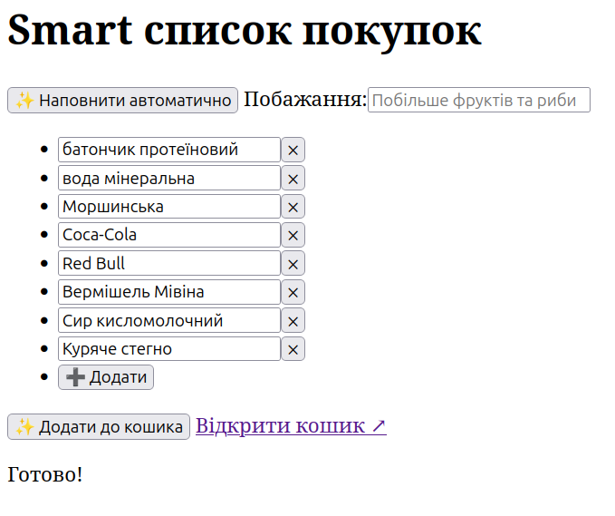
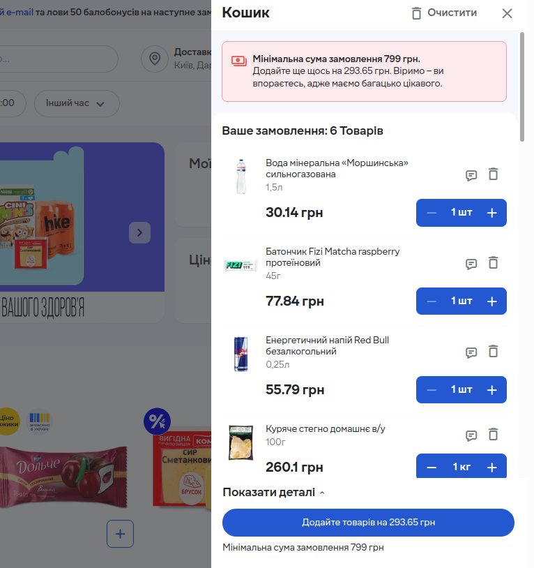

# Smart shopping list

> This is my submission for Silpo AI Factory hackaton held by Fozzy Group in September 2026.

A shopping list, integrated with an LLM and official Silpo MCP server.

Features:
- autofilling based on the user's shopping history and a manual prompt
- adding the items to the actual shopping cart
- besides, just a simple and keyboard-friendly shopping list

Screenshot:



The resulting shopping cart:



## Build & run

1. Create a `config/application.properties` file and enter API keys that are
    missing from [src/main/resources/application.properties](./src/main/resources/application.properties).

    As of 2026, a Gemini API key can be obtained in [Google AI Studio](https://aistudio.google.com)
    either for free or under a paid subscription.
2. Build the frontend (requires Deno):
    ```sh
    cd src/frontend
    deno install
    deno run build
    ```
3. Build the backend:
    ```sh
    ./gradlew bootJar
    ```
4. Run:
    ```sh
    java -jar build/libs/silpoai-0.0.1.jar
    ```

### Develop

1. Start the frontend build daemon:
    ```sh
    cd src/frontend
    deno run dev
    ```
2. Run the backend:
    ```sh
    ./gradlew bootRun
    ```

#### Autoformat code

```sh
./gradlew spotlessApply
```
